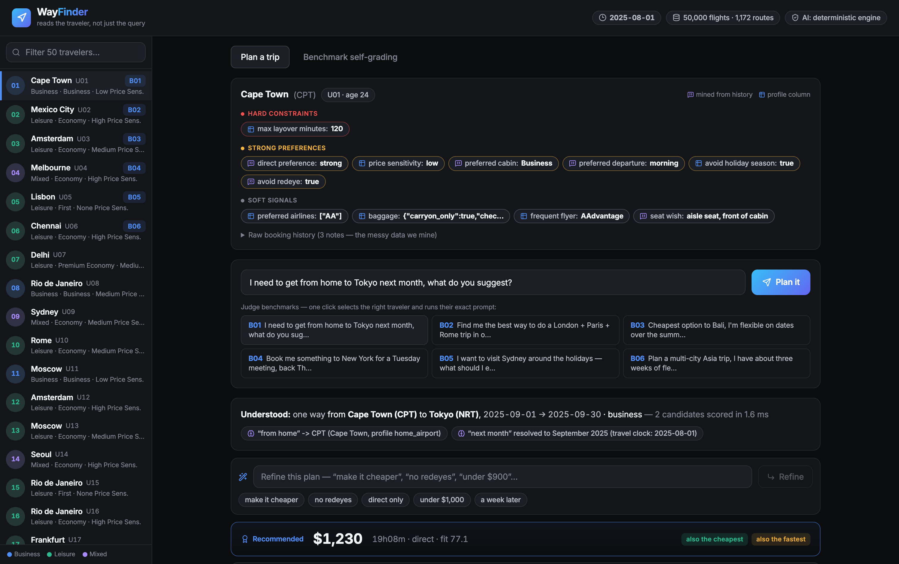
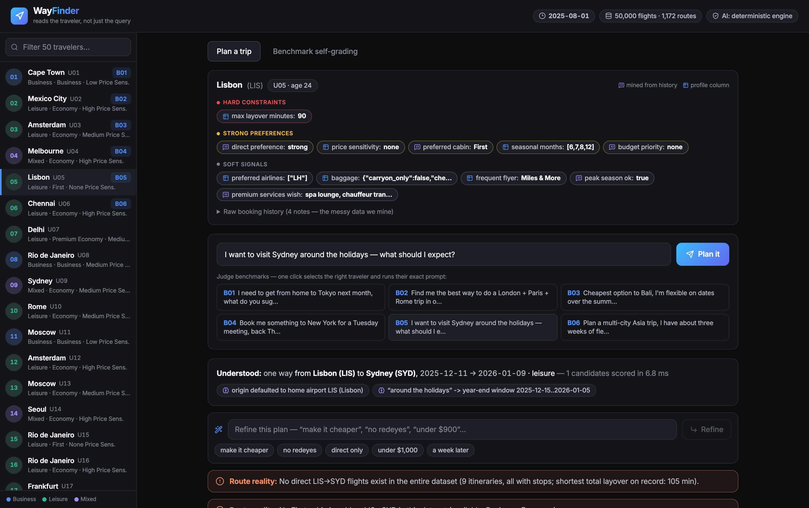
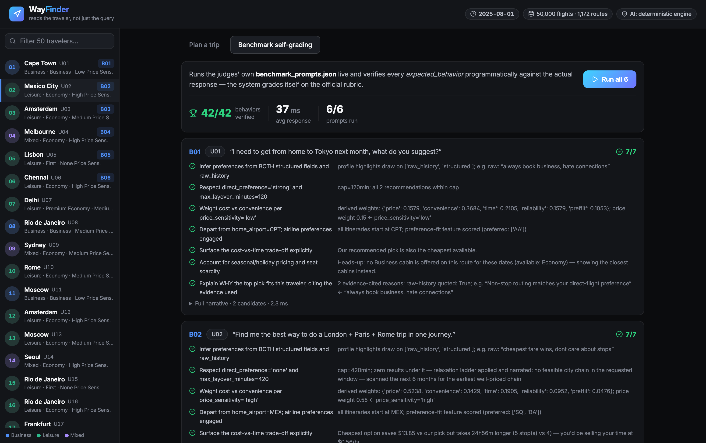

# WayFinder

### An AI Air Travel Companion that reads the traveler, not just the query

**Expedia Group Campus Hackathon 2026 · Problem Statement 1: AI Air Travel Companion**
Author: Ishika Sattawan

WayFinder is a personal air travel strategist. It fuses each traveler's structured profile with
the messy, free text history of how they actually book, turns that into hard constraints and
personalized scoring weights, searches 50,000 real itineraries like a route planner, and explains
every recommendation with a cited receipt drawn from the traveler's own words.

Its defining property is that every decision is auditable. A self grading harness runs the six
official benchmark prompts and programmatically verifies every expected behavior. All 42 of 42
pass, fully deterministically, with each response returning in under half a second, and with the
language model entirely optional.

---

## Table of Contents

1. [Highlights](#highlights)
2. [Screenshots](#screenshots)
3. [Quick Start](#quick-start)
4. [Using the App](#using-the-app)
5. [How It Works](#how-it-works)
6. [Tech Stack](#tech-stack)
7. [Datasets and Inputs](#datasets-and-inputs)
8. [Testing and Benchmark Evidence](#testing-and-benchmark-evidence)
9. [The Simulated Travel Clock](#the-simulated-travel-clock)
10. [Optional AI Assist Mode](#optional-ai-assist-mode)
11. [Assumptions, Limitations, and Future Work](#assumptions-limitations-and-future-work)
12. [Repository Structure](#repository-structure)
13. [Documentation](#documentation)

---

## Highlights

- **Preference fusion with provenance.** Structured profile columns are merged with signals mined
  from raw booking history. Every inferred preference carries a confidence score and the exact
  evidence it came from. Contradictions, such as a sixty six year old whose history reads "broke
  student," are detected, resolved by a behavioral evidence wins policy, and shown to the user.
- **A route engine that never dead ends.** Date window search, self composed connections when no
  published fare serves a request, timezone correct weekday patterns, multi city visit order
  optimization, and open ended regional discovery. When constraints cannot be met, a transparent
  relaxation ladder loosens them one documented step at a time.
- **Personalized, explainable ranking.** Scoring weights are derived from the profile through a
  documented mapping. Every result carries a fit score from 0 to 100, a per feature breakdown, and
  evidence cited reasons.
- **Conversational refinement.** Follow ups like "make it cheaper," "no redeyes," or "under $900"
  patch the original request and re rank it, without forgetting any earlier constraint. Impossible
  follow ups degrade honestly to the closest option.
- **Deterministic core, optional guarded AI.** The reasoning core is pure Python and fully
  reproducible. An optional local language model fills language gaps and polishes prose, guarded by
  a number integrity check that rejects any hallucinated figure. With the model off, the entire
  system still passes every benchmark.

## Screenshots

| Personalized results with receipts | Multi city routing on an offline map |
| --- | --- |
|  |  |

| The relaxation ladder in action | Live self grading, 42 of 42 |
| --- | --- |
|  |  |

## Quick Start

Prerequisites: Python 3.12 or newer, and Node 18 or newer.

```powershell
# 1. Backend
cd backend
pip install -r requirements.txt
python -m app.data.loader            # data QA smoke test
python -m pytest tests -q            # 38 tests
python -m benchmark.run_benchmarks   # regenerates reports/benchmark_report.md (42 of 42)

# 2. Frontend (one time build; FastAPI then serves it)
cd ../frontend
npm install
npm run build

# 3. Run, then open http://localhost:8000
cd ../backend
python -m uvicorn app.main:app --port 8000
```

For hot reload during development, run `uvicorn app.main:app --reload --port 8000` alongside
`npm run dev`, which starts Vite on port 5173 and proxies `/api` to the backend.

## Using the App

1. **Pick a traveler** from the sidebar. The six judge travelers are marked with B01 to B06 badges.
2. **Click a benchmark chip** to auto select the right traveler and run their exact prompt, or type
   any request of your own.
3. **Open the mined persona** in the traveler dossier and hover any preference chip to see the
   evidence it was inferred from, grouped by constraint strength.
4. **Refine conversationally.** After any plan, click "make it cheaper" or "no redeyes," or type
   "under $900" or "a week later." The plan re runs and every applied change is surfaced as a chip.
5. **Try the hard cases.** Traveler U06 exposes the age versus "broke student" contradiction.
   Benchmark B05 asks for a direct First class flight from Lisbon to Sydney, which does not exist in
   the data, so the relaxation ladder narrates exactly what it adjusted.
6. **Open the Benchmark tab** to run all six prompts live and watch each expected behavior verify.

## How It Works

```
query + user_id
   |
   |-- NLU:              travel clock date resolution, city gazetteer, trip shape detection
   |-- Preference Fusion: structured columns plus lexicon mining of raw history,
   |                      provenance tagged, with contradiction and party size detection
   |-- Search:           route index window lookup, self composed connections,
   |                      timezone correct round trip patterns, multi city permutation
   |                      chains, open ended beam search, and a relaxation ladder
   |-- Ranking:          weights derived from the profile, five feature goodness scores,
   |                      a 0 to 100 fit score with a full breakdown
   |-- Insights:         Recommended, Cheapest, and Fastest trade off deltas, seasonal
   |                      premiums, seat scarcity alerts, and date shift savings
   |-- Narrative:        deterministic, evidence cited explanation
   |-- Refinement loop:  follow ups parse to an intent patch, then re plan
```

A full design walkthrough is in [docs/ARCHITECTURE.md](docs/ARCHITECTURE.md).

## Tech Stack

- **Backend:** Python, FastAPI, and Pydantic. The reasoning core is a zero dependency in memory
  route graph, deliberately without pandas or a database, which keeps startup instant, results
  deterministic, and every benchmark under half a second.
- **Frontend:** React, TypeScript, Vite, and Tailwind CSS, with hand rolled SVG data visualization
  including an offline great circle route map and a price calendar, so there are no tile servers or
  external charting dependencies.
- **Optional AI:** any OpenAI compatible endpoint, defaulting to a local Ollama model.

## Datasets and Inputs

The solution is built entirely on the provided hackathon data, with no external APIs.

- `flights_data.csv`: 50,000 priced itineraries across 35 airports and 1,172 routes, each carrying
  price, seats remaining, on time performance, season, and demand level.
- `user_data.csv`: 50 traveler profiles, each with 16 structured columns plus a raw history free
  text field that holds the messy, contradictory signal the engine mines.
- `benchmark_prompts.json`: 6 judge prompts, B01 to B06, each with a list of expected behaviors.

## Testing and Benchmark Evidence

- **Benchmark harness:** `python -m benchmark.run_benchmarks` runs all six prompts end to end and
  verifies every expected behavior against the live response, then writes
  [reports/benchmark_report.md](reports/benchmark_report.md). Result: 42 of 42 behaviors verified.
- **Unit and end to end tests:** `python -m pytest tests -q` runs 38 tests covering date resolution,
  preference fusion, hard constraint invariants, the refinement loop, and every benchmark end to end.

## The Simulated Travel Clock

The flight data spans January 2025 to July 2025 and is entirely historical, so WayFinder runs on a
simulated clock, `TRAVEL_SIM_TODAY`, which defaults to 2025-08-01. That anchor was validated so that
every benchmark has real inventory in its natural window, and it is how a vague request for "next
month" resolves to a real, bookable range. The clock is shown in the application header.

## Optional AI Assist Mode

At startup WayFinder probes for a local Ollama endpoint at `http://localhost:11434/v1`. If a model
is present, it runs in assist mode: the language model fills natural language gaps for unusual
phrasings, parses free form refinement follow ups, and polishes narrative prose. Every figure it
produces is checked against the deterministic narrative and rejected if it does not match, and any
error falls back instantly to the rules path. If no endpoint is found, or `LLM_MODE=off` is set, the
header reads "AI: deterministic engine" and the entire system, including all 42 of 42 benchmark
behaviors, works identically. Set `LLM_MODE` to `assist` or `off` to override the auto detection.

## Assumptions, Limitations, and Future Work

**Assumptions** are documented in full in [docs/ASSUMPTIONS.md](docs/ASSUMPTIONS.md), and cover the
simulated travel clock, per person USD pricing, total layover semantics, seat availability as a hard
floor, self composed connection rules, and one airport per city.

**Limitations.** The dataset is synthetic, with sparse route and month coverage, which the engine
handles through composed connections and the relaxation ladder rather than through real inventory.
There is no live booking or fare class data, prices are point in time snapshots, and there are no
seat maps, so seat wishes are acknowledged but not optimized.

**Future work.** Live NDC and GDS feeds to replace the synthetic dataset, learning to rank trained
on real booking outcomes on top of the current transparent weights, cross product bundling for
hotels and cars on the same trip clock, carbon aware scoring, and per user weight learning.

## Repository Structure

```
backend/app/        pipeline: data, profile, nlu, search, ranking, insights, explain, llm, api
backend/benchmark/  self grading harness that writes reports/benchmark_report.md
backend/tests/      38 pytest tests
frontend/           React, TypeScript, and Tailwind UI
data/               the three provided hackathon files
docs/               ARCHITECTURE.md, ASSUMPTIONS.md, BLUEPRINT.md
deliverables/       solution_summary.pdf, deck.pdf, and UI screenshots
reports/            benchmark_report.md (generated)
```

## Documentation

- [docs/ARCHITECTURE.md](docs/ARCHITECTURE.md): system design and the reasoning pipeline.
- [docs/ASSUMPTIONS.md](docs/ASSUMPTIONS.md): the full assumptions register.
- [docs/BLUEPRINT.md](docs/BLUEPRINT.md): the original end to end engineering blueprint.
- [deliverables/solution_summary.pdf](deliverables/solution_summary.pdf): the one page solution summary.
- [deliverables/deck.pdf](deliverables/deck.pdf): the presentation deck.
