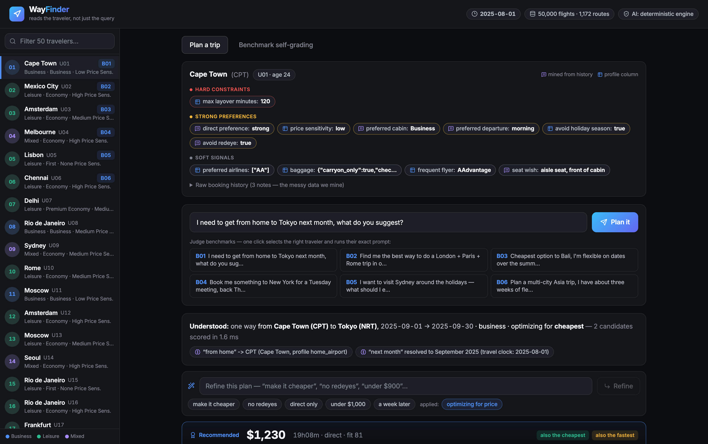

<!-- _class: lead invert -->

# ✈ WayFinder
## The AI travel strategist that reads the traveler, not just the query

**Expedia Hackathon · Problem Statement 1 · AI Air Travel Companion**

Solo submission — Tarun Aryan

<span class="small">50,000 itineraries · 50 travelers · 6/6 judge benchmarks · 42/42 expected behaviors verified</span>

---

## Same question, six different right answers

> "I want to visit Sydney around the holidays."

- For **U05** (Lisbon, First cabin, 90-min layover cap): a Business cabin via Paris at **$10k** — with an honest warning that no First is sold on the route.
- For a broke student, the right answer is **two stops and $900**.

Flight search that ignores *who's asking* is broken. WayFinder fuses each traveler's **structured profile** with their **messy free-text booking history** into constraints, weights, and receipts.

<span class="small">Given: flights_data.csv (50,000 rows) · user_data.csv (50 travelers) · benchmark_prompts.json (6 judged prompts)</span>

---

## The data has traps — we found them and built for them

| Trap in the dataset | What WayFinder does |
|---|---|
| **LIS→SYD has zero direct flights**, no First cabin — while U05 demands direct-only + First | Route-reality banners + a **relaxation ladder** that narrates every constraint it loosens |
| Service is **sparse by month** (MEL↔JFK never pairs Tue–Thu) | Self-composed connections & **nearest-window scan** across 6 months |
| **Deliberate contradictions**: age 66 vs *"broke student"* in history | Contradiction detection — shown to the user, resolved by behavioral-evidence-wins |
| Histories are messy free text (*"redeyes kill my mornings"*) | Preference mining with **provenance**: every chip cites its source |

---

## Architecture — deterministic core, AI-assisted edge

```
query ─► NLU (travel clock · gazetteer · trip shape)
      ─► Preference Fusion (structured ⊕ mined history → provenance-tagged)
      ─► Search (time-expanded graph · beam search · permutation chains ·
                 self-composed connections · relaxation ladder)
      ─► Ranking (profile-derived weights → 0–100 fit score + breakdown)
      ─► Insights (Recommended/Cheapest/Fastest deltas · seasonal premiums)
      ─► Narrative (evidence-cited) ─► conversational refinement loop
```

- **AI where it helps:** local LLM (Ollama) parses unusual phrasing & polishes prose — behind a **number-integrity check** that rejects any hallucinated figure.
- **Guarantee:** with the LLM completely off, all 42/42 benchmark behaviors still pass. *The demo cannot die on stage.*

---

## Preference fusion with receipts


<span class="small">Every chip is provenance-tagged (profile column vs verbatim history quote) and grouped hard / strong / soft. Route reality is stated before the results.</span>

---

## Optimization that explains itself — and takes follow-ups



<span class="small">"make it cheaper" → intent patched, plan re-run, applied changes chipped. Recommended pick carries a fit-score ring, per-feature breakdown, and reasons quoting the traveler's own history.</span>

---

## Graded by the judges' own rubric — live, in the app


**42/42 expected behaviors verified · ~30 ms average response · fully reproducible** (26 pytest tests alongside; report regenerates with one command)

---

## Impact & what's next

**For travelers** — constraints respected (family seats, layover caps, school holidays), expectations set (holiday premiums, seat scarcity), every recommendation explained in their own words.

**For the platform** — higher search-to-book conversion, fewer support escalations, and an **auditable ranking system**: every decision traces to evidence, not a black box.

**Next:** live NDC/GDS feeds · learning-to-rank from booking outcomes · hotel/car bundling · CO₂-aware scoring · per-user weight learning from accept/reject feedback.

---

<!-- _class: lead invert -->

# Demo video

**3–5 minutes · the working prototype end-to-end**

Same question, different travelers → evidence-cited picks → conversational refinement → relaxation ladder honesty → 42/42 live self-grading

<span class="small">Repository includes README quick start, assumptions, limitations & future work · deterministic reproduction of every claim in this deck</span>
