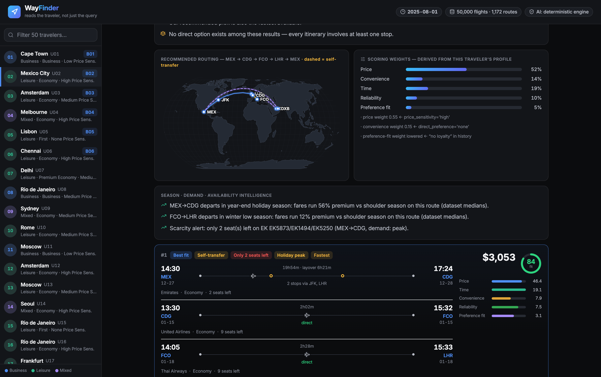

<!-- PAGE 1 : COVER -->

<svg width="30" height="30" viewBox="0 0 34 34" aria-hidden="true"><rect x="1" y="1" width="32" height="32" rx="8" fill="#FDB92C"/><path d="M11.5 21.5 L21.5 11.5 M21.5 11.5 L21.5 17.5 M21.5 11.5 L15.5 11.5" stroke="#10152E" stroke-width="2.7" fill="none" stroke-linecap="round" stroke-linejoin="round"/></svg>
Expedia
Campus Hackathon 2026 · Problem Statement 1

WayFinder

The AI travel companion that reads the traveler, not just the query.

A traveler tells you how they fly in two places. Half sits in their profile. The other half is buried in messy history like <em>"redeyes kill my mornings."</em> WayFinder reads both, fuses them into one traveler model, searches 50,000 real itineraries, and shows a receipt for every decision it makes.

<b>Ishika Sattawan</b>
Build the Future of Travel · Innovation Round

<b>50,000</b>Itineraries

<b>50</b>Travelers

<b>42/42</b>Behaviors Verified

<i style="background:#ff5f57"></i><i style="background:#febc2e"></i><i style="background:#28c840"></i>localhost:8000 · WayFinder

The live product: multi-city routing rendered on a real great-circle map

---

<!-- PAGE 2 : PROBLEM STATEMENT -->

I Problem Statement

## Six travelers, one query, one lazy answer

Ask six different people to <b>"find me a flight"</b> and today's search hands all six the same list. A backpacker chasing the cheapest red-eye and a family of three with a stroller get treated as if they are the same person. They are not.

<h4>Filters cannot read a human</h4>

"Redeyes kill my mornings" means nothing to a dropdown. The preferences that actually decide a booking never fit in a checkbox.

<h4>The real signal is hiding</h4>

Two kids. A 90 minute layover limit. School holidays only. It is all sitting in messy booking history, and nobody bothers to read it.

<h4>So travelers bounce</h4>

Every irrelevant top result is a booking the platform never makes, and often a support ticket it will. Generic ranking caps conversion no matter how good the inventory is.

The gap: personalization that understands messy humans, and can prove how it did it.

---

<!-- PAGE 3 : SOLUTION OVERVIEW -->

II Solution Overview

## WayFinder reads the traveler, not just the query

1
<h4>Preference Fusion, with receipts</h4>

Mines the messy free-text history with a curated signal lexicon and fuses it with the structured profile. Every inferred preference carries a confidence score and a verbatim quote, so you can see exactly where it came from. Contradictions get flagged, never silently overwritten.

2
<h4>A route engine that never dead-ends</h4>

Searches 50,000 itineraries with visit-order optimization for multi-city trips and composes its own connections when no published fare exists. When constraints cannot be met, a Relaxation Ladder loosens them one documented step at a time.

3
<h4>A conversation, not a one-shot</h4>

Say "make it cheaper" or "no redeyes" and it patches the original request and re-ranks, without forgetting anything you already asked for. Personalized fit scores from 0 to 100, every result explained in plain language.

Deterministic core
Optional guarded LLM
Evidence on every pick
Trade-offs made explicit
Seasonal &amp; scarcity aware

---

<!-- PAGE 4 : ARCHITECTURE / WORKFLOW -->

III Architecture &amp; Workflow

## From a vague sentence to an explained itinerary

Input

Query + Traveler

"Get me to Tokyo next month" for a specific profile

Step 1 · NLU

Understand the ask

Resolves dates against a simulated travel clock, detects trip shape

Step 2 · Fusion

Build the traveler

Profile plus mined history, every signal provenance-tagged

Step 3 · Search

Find real routes

Beam and permutation search, self-composed connections, relaxation ladder

Step 4 · Score

Rank for this person

Profile-derived weights produce a 0 to 100 fit score with a breakdown

Step 5 · Explain

Show the receipts

Trade-offs, seasonal and scarcity insights, evidence-cited narrative

<b>Why it is built this way:</b> the core is a deterministic Python engine, so results are reproducible and the demo cannot break on stage. The LLM is optional and guarded, so every number it produces is checked against the deterministic engine and rejected if it does not match. With the AI switched fully off, the whole system still passes every test.

---

<!-- PAGE 5 : DATASETS / INPUTS -->

IV Datasets &amp; Inputs Used

## Built entirely on the provided hackathon data

flights_data.csv

50,000

Priced Itineraries

35 airports, 1,172 routes, 0 to 2 stops each. Carries price, seats left, on-time rate, season, and demand level per flight.

user_data.csv

50

Traveler Profiles

16 structured columns plus a raw_history free-text field full of the messy, contradictory, real-world signal the engine mines.

benchmark_prompts.json

6

Judge Prompts

B01 to B06, each with a list of expected behaviors. The app grades itself against these live.

<b>One honest design note:</b> the flight data is historical, so WayFinder runs on a simulated travel clock set to August 2025. That is how a vague "next month" turns into a real, bookable window instead of a broken date. No external APIs, fully offline, exactly as the toolkit intended.

---

<!-- PAGE 6 : DEMO VIDEO -->

V Demo Video

## See it think, live (3 to 5 minutes)

<ul class="demo-list">
<li><b>Personalization with receipts</b> · hover any preference to see the quote it came from</li>
<li><b>Conversational refinement</b> · "make it cheaper", "under $900", it never forgets or fakes</li>
<li><b>The family trap</b> · books 3 seats from "traveling with 2 kids", narrows to school holidays</li>
<li><b>The impossible request</b> · no direct Lisbon to Sydney exists, watch the Relaxation Ladder</li>
<li><b>Multi-city map</b> · every visit order tried, self-composed connections drawn as dashed arcs</li>
<li><b>Self-grading</b> · runs the judges' own prompts and verifies 42 of 42 behaviors on screen</li>
</ul>

Watch the 3 to 5 min demo

[ paste OneDrive / YouTube link here ]

---

<!-- PAGE 7 : IMPACT & CLOSE -->

✦ Why It Wins

## Proven, differentiated, and ready to grow

Proof
<h4>42 of 42 behaviors verified</h4>

The app grades itself against the judges' own benchmark file, deterministically, reproducible with one command. Not screenshots, actual checks.

Differentiation
<h4>Personalization you can audit</h4>

Every recommendation traces to a cited reason. Receipts on preferences, honesty when a request is impossible, a conversation that remembers.

Impact for Expedia
<h4>Conversion, trust, deflection</h4>

Relevant first results lift search-to-book. Transparent pricing and layover explanations pre-empt support tickets. Auditable ranking survives review.

Roadmap
<h4>Built to extend, not throw away</h4>

Live NDC and GDS feeds, learning-to-rank from real booking outcomes, and cross-product bundling for hotels and cars on the same trip clock.

Personalization you can actually audit. Thank you.

