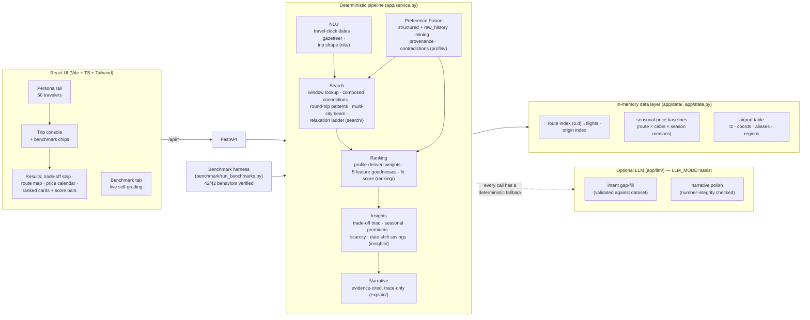

# WayFinder Architecture

## System diagram

## Design principles

1. **Deterministic core, optional AI edge.** Every judged behavior is produced by auditable
   code (filters, beam search, weighted scoring, templates). The LLM only fills NLU gaps and
   polishes prose, with hard fallbacks and a number-integrity check. `LLM_MODE=off` passes all
   benchmarks — the demo cannot die on stage.
2. **Trace-first explanations.** The narrative generator consumes only pipeline artifacts
   (fused preferences with evidence, filter counts, relaxation steps, trade-off deltas,
   baseline premiums). It never re-derives, so every sentence is backed by a traceable number.
3. **Constraints are respected or visibly relaxed — never silently violated.** Hard filters
   (seats ≥ party, layover cap) either hold, or a recorded relaxation step explains exactly
   what was loosened and why. The benchmark harness enforces this as an invariant.
4. **Weights are computed, not hardcoded.** `price_sensitivity=high` → w_price 0.55;
   `direct_preference=strong` → w_convenience 0.35 and full stop-penalty; business purpose →
   reliability ×1.5; a "cheapest" query shifts +0.20 to price *without* erasing inferred needs
   (B03: the family's 3-seat and direct-flight needs survive the "cheapest" ask, and the
   narrative explains the tension).
5. **No database, no cache invalidation.** 50k rows load in ~2 s into dict indices; every
   request is stateless and sub-500 ms. Right-sized engineering for the problem.

## Search algorithms

| Trip shape | Algorithm |
|---|---|
| One-way | Route-index window lookup; if <3 published options, compose 2-ticket connections through any hub (90 min–26 h transfer, same airport) |
| Round trip | Outbound × return pairing; weekday patterns ("Tue meeting, back Thu") use destination-local deadlines (arrive ≤3 days before, before 09:00; return on the named day ±1) |
| Multi-city, known cities (B02) | All visit-order permutations × dated leg chains; beam width 60; stays 2–5 days (adaptive to 21 when the schedule is sparse); legs may be composed connections |
| Open-ended discovery (B06) | Beam search over the region's route graph from home: seed to every region airport, expand 2 hops to unvisited cities, close the loop home within the trip-length cap; best chain per distinct city-set |
| Flexible dates | Per-departure-date best option → price calendar + "shift dates, save $X" counterfactual |

**Relaxation ladder** (each step recorded and narrated): widen dates by the user's own
flexibility → build self-transfer connections → drop the weekday pattern → relax layover cap
×1.5 then ×2 → widen dates +30d → jump to the nearest month with service.

## Scoring

`fit = 100 × Σ w_f × g_f` over five features — price, time, convenience, reliability,
preference-fit. Goodnesses are normalized within the candidate set (price/time min-max) or
absolute (penalty-based convenience; on-time + seat-headroom reliability; airline/alliance/
cabin/baggage/refundability fit). The UI shows the per-feature breakdown on every card, so a
judge can see *why* #1 beat #2.
